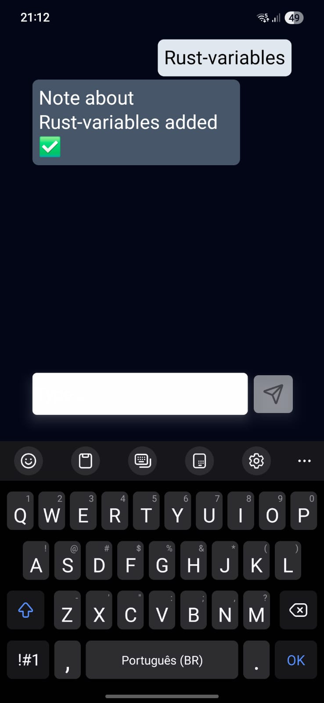
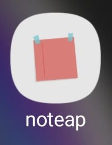

# noteap-app

Noteap App é um aplicativo de anotações desenvolvido com React Native e Expo, focado em simplicidade e experiência de usuário. Ele permite que você envie mensagens, armazene conversas localmente e interaja com uma API remota para processar ou registrar suas anotações.

<div align="center">
    
    
</div>

## Funcionalidades

- Envio de mensagens e anotações.
- Armazenamento local das mensagens usando AsyncStorage.
- Interface responsiva e estilizada com Tailwind CSS via NativeWind.
- Comunicação com API externa para processar ou registrar anotações.

## Estrutura do Projeto

- `App.tsx`: Ponto de entrada do app.
- [`src/App/Profile.tsx`](src/App/Profile.tsx): Tela principal de interação e exibição das mensagens.
- [`src/components/Input.tsx`](src/components/Input.tsx): Componente de entrada de texto e envio.
- [`src/components/ListConatiner.tsx`](src/components/ListConatiner.tsx): Exibição das mensagens.
- [`src/Storage/index.tsx`](src/Storage/index.tsx): Funções para armazenamento local.
- [`src/utils/HandleSubmit.tsx`](src/utils/HandleSubmit.tsx) e [`src/utils/OnSubmit.tsx`](src/utils/OnSubmit.tsx): Lógica de envio e manipulação das mensagens.
- [`src/types/Message.ts`](src/types/Message.ts): Tipagem das mensagens.

## Como rodar

1. Instale as dependências:

```sh
npm install
```

2. Inicie o Projeto

```sh
npm start
```
3. Siga as instruções do Expo para rodar no emulador ou dispositivo físico.

## Configuração

- O endpoint da API pode ser configurado no arquivo .env.

## Tecnologias
- React Native
- Expo
- TypeScript
- NativeWind (Tailwind CSS para React Native)
- AsyncStorage

# Licença
[[MIT]]