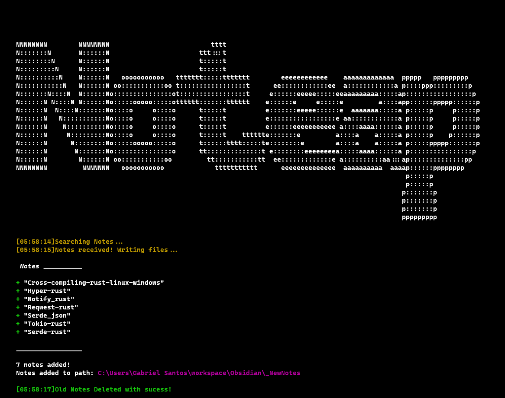

# Noteap Client

Um cliente em Rust para baixar, salvar e gerenciar notas sincronizadas de um servidor remoto.

<div align='center'>

</div>

## Funcionalidades

- Busca notas do servidor remoto via HTTP.
- Salva as notas como arquivos `.md` em uma pasta local (compatível com Obsidian).
- Notifica o usuário sobre o status do download e escrita das notas.
- Remove notas do servidor após o download bem-sucedido.
- Exibe mensagens coloridas e estilizadas no terminal.

## Como usar

1. **Clone o repositório:**

- Clone o repositório para ter acesso aos arquivos.

2. **Configure a URL do servidor:**

- Edite o arquivo req.rs e substitua "your_url" pela URL correta da sua API.

3. **Compile o projeto:**

```sh
cargo build --release
```

1. **Execute o cliente:**

```sh
cargo run
```

### Estrutura das Notas

Cada nota deve conter os campos title e text no formato JSON recebido do servidor.

- Dependências
- chrono
- colored
- dirs
- notify-rust
- reqwest
- serde_json
- tokio

### Estrutura do Projeto

- main.rs: Ponto de entrada da aplicação.
- modules: Módulos auxiliares para requisições, escrita, verificação, branding, etc.

## Observações

- As notas são salvas por padrão em uma subpasta de ~/workspace/Obsidian/\_NewNotes (ou na pasta atual se o diretório padrão não existir).
- O projeto utiliza notificações do sistema para informar o usuário sobre o progresso.

## Conclusão

Este projeto Rust foi a inicialização da linguagem, e com ctz será apenas o primeiro.
